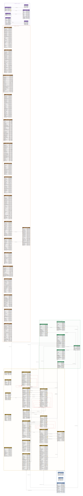

# Database Schema Reference

**Current Schema Version:** 7.24

## Schema Version Mapping

| Operaton Version   | Schema Version |
|--------------------|----------------|
| 1.0, 1.1, 2.0, 2.1 | 7.24           |

## Overview

The Operaton database schema is organized by table prefix. Each prefix corresponds to a functional
domain.

| Domain                      | Prefix    | Tables |
|-----------------------------|-----------|-----|
| [General](general.md)       | `ACT_GE_` | 3   |
| [Repository](repository.md) | `ACT_RE_` | 6   |
| [Runtime](runtime.md)       | `ACT_RU_` | 16  |
| [History](history.md)       | `ACT_HI_` | 18  |
| [Identity](identity.md)     | `ACT_ID_` | 6   |

## Quick Reference: All Tables

### General

| Table                                               | Purpose                              |
|-----------------------------------------------------|--------------------------------------|
| [`ACT_GE_PROPERTY`](general.md#act_ge_property)     | System configuration key-value store |
| [`ACT_GE_BYTEARRAY`](general.md#act_ge_bytearray)   | Binary object storage (BLOBs)        |
| [`ACT_GE_SCHEMA_LOG`](general.md#act_ge_schema_log) | Schema migration history             |

### Repository

| Table                                                              | Purpose                                |
|--------------------------------------------------------------------|----------------------------------------|
| [`ACT_RE_CAMFORMDEF`](repository.md#act_re_camformdef)             | Camunda form definitions               |
| [`ACT_RE_CASE_DEF`](repository.md#act_re_case_def)                 | Case definitions (CMMN)                |
| [`ACT_RE_DECISION_DEF`](repository.md#act_re_decision_def)         | Decision definitions (DMN)             |
| [`ACT_RE_DECISION_REQ_DEF`](repository.md#act_re_decision_req_def) | Decision requirement definitions (DRG) |
| [`ACT_RE_DEPLOYMENT`](repository.md#act_re_deployment)             | Deployment container                   |
| [`ACT_RE_PROCDEF`](repository.md#act_re_procdef)                   | Process definitions (BPMN)             |

### Runtime

| Table                                                           | Purpose                     |
|-----------------------------------------------------------------|-----------------------------|
| [`ACT_RU_AUTHORIZATION`](runtime.md#act_ru_authorization)       | Permission rules            |
| [`ACT_RU_BATCH`](runtime.md#act_ru_batch)                       | Batch operation containers  |
| [`ACT_RU_CASE_EXECUTION`](runtime.md#act_ru_case_execution)     | CMMN case execution scopes  |
| [`ACT_RU_CASE_SENTRY_PART`](runtime.md#act_ru_case_sentry_part) | CMMN sentry condition parts |
| [`ACT_RU_EVENT_SUBSCR`](runtime.md#act_ru_event_subscr)         | Event subscriptions         |
| [`ACT_RU_EXECUTION`](runtime.md#act_ru_execution)               | Process execution scopes    |
| [`ACT_RU_EXT_TASK`](runtime.md#act_ru_ext_task)                 | External task subscriptions |
| [`ACT_RU_FILTER`](runtime.md#act_ru_filter)                     | Saved task list filters     |
| [`ACT_RU_IDENTITYLINK`](runtime.md#act_ru_identitylink)         | User/group task assignments |
| [`ACT_RU_INCIDENT`](runtime.md#act_ru_incident)                 | Runtime incidents/failures  |
| [`ACT_RU_JOB`](runtime.md#act_ru_job)                           | Async job instances         |
| [`ACT_RU_JOBDEF`](runtime.md#act_ru_jobdef)                     | Job execution definitions   |
| [`ACT_RU_METER_LOG`](runtime.md#act_ru_meter_log)               | Engine performance metrics  |
| [`ACT_RU_TASK`](runtime.md#act_ru_task)                         | Active user tasks           |
| [`ACT_RU_TASK_METER_LOG`](runtime.md#act_ru_task_meter_log)     | Task metrics                |
| [`ACT_RU_VARIABLE`](runtime.md#act_ru_variable)                 | Process and task variables  |

### History

| Table                                                   | Purpose                          |
|---------------------------------------------------------|----------------------------------|
| [`ACT_HI_ACTINST`](history.md#act_hi_actinst)           | Historic activity instances      |
| [`ACT_HI_ATTACHMENT`](history.md#act_hi_attachment)     | Task/process attachments         |
| [`ACT_HI_BATCH`](history.md#act_hi_batch)               | Historic batch records           |
| [`ACT_HI_CASEACTINST`](history.md#act_hi_caseactinst)   | Historic case activity instances |
| [`ACT_HI_CASEINST`](history.md#act_hi_caseinst)         | Historic case instances          |
| [`ACT_HI_COMMENT`](history.md#act_hi_comment)           | Task/process comments            |
| [`ACT_HI_DEC_IN`](history.md#act_hi_dec_in)             | Decision evaluation inputs       |
| [`ACT_HI_DEC_OUT`](history.md#act_hi_dec_out)           | Decision evaluation outputs      |
| [`ACT_HI_DECINST`](history.md#act_hi_decinst)           | Historic decision evaluations    |
| [`ACT_HI_DETAIL`](history.md#act_hi_detail)             | Variable change details          |
| [`ACT_HI_EXT_TASK_LOG`](history.md#act_hi_ext_task_log) | External task execution history  |
| [`ACT_HI_IDENTITYLINK`](history.md#act_hi_identitylink) | Historic identity link changes   |
| [`ACT_HI_INCIDENT`](history.md#act_hi_incident)         | Historic incidents               |
| [`ACT_HI_JOB_LOG`](history.md#act_hi_job_log)           | Job execution history            |
| [`ACT_HI_OP_LOG`](history.md#act_hi_op_log)             | Operator audit log               |
| [`ACT_HI_PROCINST`](history.md#act_hi_procinst)         | Historic process instances       |
| [`ACT_HI_TASKINST`](history.md#act_hi_taskinst)         | Historic task instances          |
| [`ACT_HI_VARINST`](history.md#act_hi_varinst)           | Historic variable values         |

### Identity

| Table                                                      | Purpose                      |
|------------------------------------------------------------|------------------------------|
| [`ACT_ID_GROUP`](identity.md#act_id_group)                 | Groups/roles                 |
| [`ACT_ID_INFO`](identity.md#act_id_info)                   | Extended user information    |
| [`ACT_ID_MEMBERSHIP`](identity.md#act_id_membership)       | User↔Group membership        |
| [`ACT_ID_TENANT`](identity.md#act_id_tenant)               | Tenants                      |
| [`ACT_ID_TENANT_MEMBER`](identity.md#act_id_tenant_member) | User/Group↔Tenant membership |
| [`ACT_ID_USER`](identity.md#act_id_user)                   | User accounts                |

---

## ER Diagram

An overview of the schema is available in the . 

Open the diagram in a browser to zoom and pan or download it for offline viewing. 


---

## Common Query Patterns

### Find all tasks for a user

```sql
SELECT t.*
FROM ACT_RU_TASK t
         LEFT JOIN ACT_RU_IDENTITYLINK il ON t.ID_ = il.TASK_ID_
WHERE il.USER_ID_ = 'john.doe'
   OR t.ASSIGNEE_ = 'john.doe'
ORDER BY t.CREATE_TIME_ DESC;
```

See [runtime.md → ACT_RU_TASK](runtime.md#act_ru_task)

### Get process variables

```sql
SELECT NAME_, TYPE_, TEXT_, LONG_, DOUBLE_
FROM ACT_RU_VARIABLE
WHERE PROC_INST_ID_ = 'proc-id';
```

See [runtime.md → ACT_RU_VARIABLE](runtime.md#act_ru_variable)

### Latest process definition version by key

```sql
SELECT ID_, KEY_, VERSION_, DEPLOYMENT_ID_
FROM ACT_RE_PROCDEF
WHERE KEY_ = 'invoice_approval'
ORDER BY VERSION_ DESC LIMIT 1;
```

See [repository.md → ACT_RE_PROCDEF](repository.md#act_re_procdef)

### Authorization rules for a user

```sql
SELECT RESOURCE_TYPE_, RESOURCE_ID_, PERMS_
FROM ACT_RU_AUTHORIZATION
WHERE USER_ID_ = 'john.doe'
   OR GROUP_ID_ IN (SELECT GROUP_ID_
                    FROM ACT_ID_MEMBERSHIP
                    WHERE USER_ID_ = 'john.doe');
```

See [runtime.md → ACT_RU_AUTHORIZATION](runtime.md#act_ru_authorization)

### Failed jobs with retry count

```sql
SELECT j.ID_, j.TYPE_, j.PROCESS_INSTANCE_ID_, j.RETRIES_, j.EXCEPTION_MSG_
FROM ACT_RU_JOB j
WHERE j.RETRIES_ = 0
ORDER BY j.DUEDATE_ DESC;
```

See [runtime.md → ACT_RU_JOB](runtime.md#act_ru_job)

---

## Key Schema Design Patterns

### Optimistic Locking

All mutable tables include `REV_ INTEGER`. Every UPDATE must match the current `REV_` and increment
it. Stale reads result in a zero-row update, triggering a retry.

### Multi-Tenancy

Most tables carry `TENANT_ID_ VARCHAR(64)`. All queries should filter by tenant where data isolation
is required.

### Soft Deletion

`REMOVAL_TIME_ TIMESTAMP` marks rows for deferred cleanup. The history cleanup job deletes rows
where `REMOVAL_TIME_ < NOW()`. Never delete these rows manually while the engine is running.

### Hierarchical Execution

`ACT_RU_EXECUTION` is self-referential: `PARENT_ID_` → parent scope, `PROC_INST_ID_` → root
execution (when `PROC_INST_ID_ = ID_`, the row is the root), `SUPER_EXEC_` → calling execution in a
parent process.

### Variable Storage

`ACT_RU_VARIABLE` uses a discriminated-union layout: scalar types use `LONG_`, `DOUBLE_`, or
`TEXT_`; binary types store a reference in `BYTEARRAY_ID_` pointing to `ACT_GE_BYTEARRAY`.

### Job Priority and Locking

`ACT_RU_JOB.PRIORITY_` controls execution order; `LOCK_OWNER_` + `LOCK_EXP_TIME_` implement
optimistic distributed locking so multiple engine nodes don't double-execute the same job.

### Incident Chain

`ACT_RU_INCIDENT.CAUSE_INCIDENT_ID_` → direct cause; `ROOT_CAUSE_INCIDENT_ID_` → original root.
Enables root-cause traversal in failure chains.

---

## Column Naming Conventions

| Suffix                      | Meaning               | Example                           |
|-----------------------------|-----------------------|-----------------------------------|
| `_ID_`                      | PK or FK identifier   | `PROC_DEF_ID_`, `TASK_ID_`        |
| `_KEY_`                     | Stable business key   | `PROC_DEF_KEY_`, `TASK_DEF_KEY_`  |
| `_NAME_`                    | Human-readable label  | `PROC_NAME_`, `TASK_NAME_`        |
| `_TIME_` / `_TIMESTAMP_`    | Point in time         | `CREATE_TIME_`, `LOCK_EXP_TIME_`  |
| `_STATE_`                   | Status integer enum   | `SUSPENSION_STATE_`               |
| `_MSG_`                     | Text message / error  | `EXCEPTION_MSG_`, `INCIDENT_MSG_` |
| `_CFG_` / `_CONFIGURATION_` | Configuration payload | `HANDLER_CFG_`                    |

| Prefix    | Domain     | Contents                                               |
|-----------|------------|--------------------------------------------------------|
| `ACT_GE_` | General    | Infrastructure: binary storage, properties, schema log |
| `ACT_RE_` | Repository | Immutable definitions: processes, decisions, forms     |
| `ACT_RU_` | Runtime    | Active execution state                                 |
| `ACT_HI_` | History    | Audit trail of completed executions                    |
| `ACT_ID_` | Identity   | Built-in user/group/tenant store                       |

---

## Database-Specific Implementation Notes

### PostgreSQL

Baseline implementation. Native types used throughout:

- `BOOLEAN` / `TIMESTAMP` / `BYTEA` / `BIGINT` / `DOUBLE PRECISION`
- Multiple NULLs allowed in UNIQUE constraints (standard behavior)
- Recommended for production

### MySQL / MariaDB

- `TINYINT(1)` for boolean columns
- `DATETIME` (MySQL) or `DATETIME(3)` (MariaDB) for timestamps
- `LONGBLOB` for binary data; `LONGTEXT` for unlimited text
- Index prefix limitation: VARCHAR(4000) columns use first ~300 chars in indexes
- Set `max_allowed_packet` ≥ 64 MB for large BPMN/DMN payloads

### Oracle

- `VARCHAR2(n BYTE)` for text; `NVARCHAR2` for Unicode
- `NUMBER(19,0)` for BIGINT; `NUMBER(*,10)` for DOUBLE
- `BLOB` / `CLOB` for binary and large text
- `NUMBER(1,0)` + CHECK for boolean columns
- Filtered unique indexes enforce uniqueness on non-NULL values only

### MSSQL

- `nvarchar(n)` throughout for Unicode
- `datetime2` for high-precision timestamps
- `BIT` or `TINYINT` for boolean columns
- `VARBINARY(max)` for binary data
- Filtered unique indexes supported

### H2

- Behaves like PostgreSQL; suitable for in-memory testing

### DB2

- Fixed VARCHAR size limits (`VARCHAR(64)` for IDs, `VARCHAR(255)` for names)
- `SMALLINT` + CHECK for boolean columns
- Explicit `NOT NULL` required

### Cross-Platform Notes

- **NULL in UNIQUE constraints:** PostgreSQL, MySQL, MariaDB, H2, MSSQL — multiple NULLs allowed.
  Oracle — enforced via filtered index on non-NULL values only.
- **Collation:** Use UTF-8 character sets in all databases for multi-language process data.
- **CASCADE deletes:** Behavior varies. Verify FK cascade behavior in your target database before
  bulk deletes.

---

**Last Updated:** 2026-07-03 | **Schema Version:** 7.24 | **Operaton Versions:** 1.0.0+
